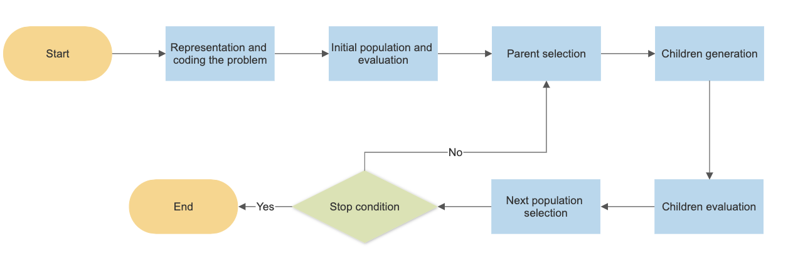
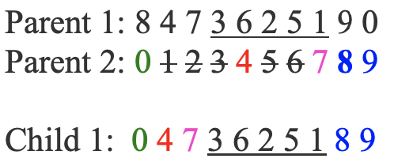
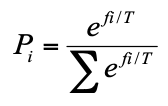
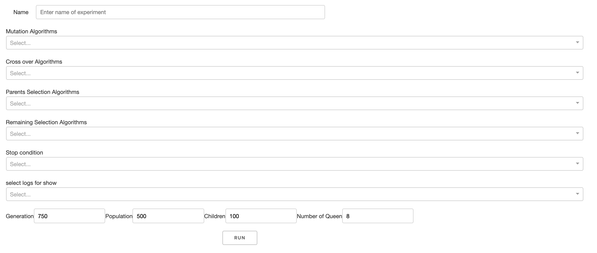
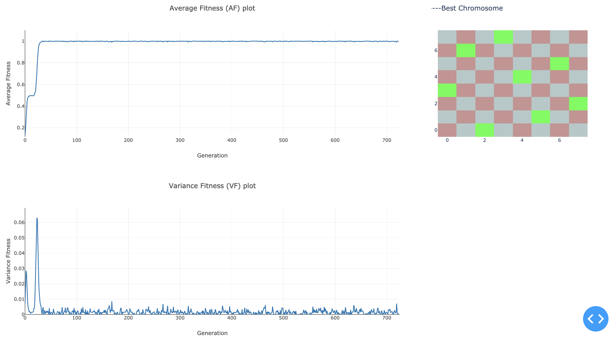
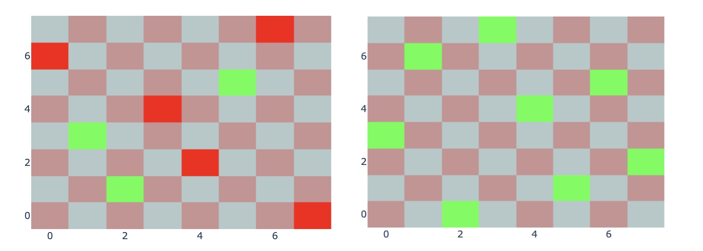

# Evolutionary Algorithm for N queen problem
In this project, the evolutionary algorithm with various approaches has been implemented and applied on the n queen problem. In the Introduction section the well-known n queen problem and the general overview of evolutionary algorithms will be discussed. Afterwards, in the implementation section we will go into the details of evolutionary algorithm's implementation. A quick installation guide and the procedure of running and analyzing the results have been described in section 3. Eventually, if you want to contribute in the project, see the final part of section 3 which covers the rules you have to follow. For any further information, feel free to contact us using the information given at section 4.


# Table of contents
<ol>

  <li><b>Introduction</b>
  <ol>
    <li> [*N queen problem*](#11-n-queen-problem)</li>
    <li> [Evolutionary algorithms](#12-evolutionary-algorithms)</li>
  </ol>
  </li>

  <li><b>Implementation</b>
  <ol>
    <li>[*evolutionary_algorithms.py*](#21-evolutionaryalgorithm-class-evolutionary_algorithmspy)</li>
    <li>[*evolutionary_algorithms_functions.py*](#22-evolution-algorithm-functions-evolutionary_algorithms_functionspy)</li>
    <li>[*chromosome.py*](#23-chromosome-class-chromosomepy)</li>
  </ol>
  </li>
  <li><b>Quick tour</b>
  <ol>
    <li>[*Installation guide*](#31-installation-guide)</li>
    <li>[*Graphical User Interface*](#32-graphical-user-interface)</li>
    <li>[*A few words with contributors*](#33-a-few-words-with-the-contributors)</li>
  </ol>
  </li>
  <li><b>[contact us](#4-contact-us)</b>
  </li>
</ol>

# 1. Introduction

## 1.1. N queen problem
N queen problem was invented by chess composer, Max Bezzel, in 1848. Since then many mathematicians and computer scientists have been interested on this problem. In 1972, Edsgar Dijkstra proposed a method based on depth-first-backtracking to solve the challenge.<br/>
The whole idea pf the challenge is *to place n queens on a nxn chessboard in a way that not any couple of queens threaten each other*. Figure 1 shows the case where n is 4. It can be seen in this figure that none of the queens threaten each other.<br/><br/>

<div align="center">

<figcaption>Figure 1: one solution for 4 queen problem</figcaption>
</div>

## 1.2. Evolutionary algorithms
Evolutionary algorithms are one of the solutions to solve this challenge. These algorithms are inspired from the evolutionary instinct of the being in the universe. In order to solve a challenge using this approach, the challenge has to be formulated in a specific manner. In general a evolutionary algorithm consists of the following stages which have been summarized in Figure 2:
1. define the representation
2. Initiate the population
3. parent selection
4. Children generation
5. children evaluation
6. next generation selection
7. check the stop condition, if not met repeat from step 3

<div align="center" height="200px">

<figcaption align="center">Figure 2: The flowchart for evolutionary algorithms</figcaption>
</div><br/>


In order to formulate any problem to be solved using evolutionary algorithms, the following steps have to be followed:
1. We should define a chromosome-based representation for the possible solutions, which in this specific problem it could be estimated with a list of numbers from 1 to n, with size of n where each of the elements show the ith queen's position in the chessboard e.g. the chromosome of figure 1 could be defined as [3, 1, 4, 2].
2. A fitness function should be defined showing the merit of a possible solution. In this challenge the fitness functions could be (1/the number of the queens threatening each other).
3. The initial population should be generated which consists of random chromosomes.


# 2. Implementation

## 2.1. EvolutionaryAlgorithm class (*evolutionary_algorithms.py*)
This is the main class which handles the evolution process.

### list of the attributes of the class

|Attribute name|type|Initial value|description|
|-|:-:|:-:|:-:|
|_max_generation|integer|200|Maximum number of steps that the evolution will be progressed|
|_generation_counter|integer|0|The current step of evolution|
|_population|list|[]|the list containing the whole population|
|_m|integer|160|initial number of population|
|_n|integer|8|number of the queens|
|_y|integer|80|The number of the children that are selected from generated children|
|_ n_parent|integer|80|number of the parents that should be selected from the population|
|_cross_over|function|default_cross_over|The function used to cross over two chromosomes|
|_cross_over_params|dictionary|{'prob': float(parents_prob)}|a dictionary containing the parameters of the _cross_over function|
|_mutation|function|default_mutation|The mutation approach which will be applied on a chromosome|
|_mutation_params|dictionary|{'prob': float(mutation_prob)}|a dictionary containing the parameters of the _mutation function|
|_remaining_population_selection|function|default_population_selection|Approach used for selecting the next population among the new children and the current population|
|_remaining_population_selection_params|dictionary|None|a dictionary containing the parameters of the _remaining_population_selection function|
|_parent_selection|function|default_parent_selection|functions used for selecting a subset from the parents|
|_parent_selection_params|dictionary|None|a dictionary containing the parameters of the _parent_selection function|
|_random_gene_generator|function|permutation_random_gene_generator|Function used for generating the initial population|
|_evaluator|function|default_evaluator|a function which calculates the fitness|
|_stop_condition|function|default_stop_condition|responsible for checking the stop condition(returns True if met)|
|_log|list|[]|To be saved for restoring|

### list of the methods of the class

|function name|parameters|returns|description|order|
|:-----------:|:--------:|:-----:|:---------:|:----------:|
|[*__ init __*](#__-init-__) |max_generation=200 <br/>n = 8 <br/> m = 160 <br/> number of population <br/> y = 80 <br/> mutation <br/> cross_over <br/> parent_selection <br/> remaining_population_selection <br/> evaluator <br/>  random_gene_generator <br/> stop_condition |void| Constructor method for evolutionary algorithms class|O(1)|
|[*run*](#run)|name <br/> variance_per_generation=[] <br/> avg_per_generation=[] <br/> best_chromosome=[1] <br/> verbose=False <br/> save_log=True <br/> save_log_path|void|The main method where the evolutionary algorithm is called|O(n*(order(Parent Selection Algorithm)+ y*n_queen + y*(order(Mutation Algorithm)+ order(Evaluation Algorithm)+ order(Remaining Algorithm Selection)))|
|[*_save_current_log*](#_-save_current_log)|avg_fitness_per_generation <br/> variance_per_generation <br/> best_chromosome|dictionary|Method used for saving the recent run's log|O(m)|
|[*_new_children*](#_-new_children)|parents|list|Takes a list of parents and generates a list of children with size of y|O(n_children)|
|[*_best_gen*](#_-best_gen)|-|Chromosome|Returns the best chromosome according to fitness function in the population|O(m)|
|[*_initial_population*](#_-initial_population)|-|void|Generates the initial population |O(m*n)|

### __ init __

```python
def __init__(mutation,
             cross_over,
             parent_selection,
             remaining_population_selection,
             evaluator,
             gene_generator,
             stop_condition,
             max_generation=200,
             n=8,
             m=160,
             y=80)
```

**max_generation (Integer)**: Defines the maximum number of the generations, <br/>
**n (Integer)**: Number of the queens, maybe power of 2<br/>
**m (Integer)**: Shows the number of the population<br/>
**y (Integer)**: Lambda (number of children), number of children, <br/>
**mutation (Function)**: Mutation algorithm<br/>
**cross_over (Function)**: Cross over algorithm<br/>
**parent_selection (Function)**: Selection algorithm for parents<br/>
**remaining_population_selection (Function)**: Selection algorithm for remaining population<br/>
**evaluator (Function)**: Evaluator algorithm for each chromosome<br/>
**random_gene_generator (Function)**: Random algorithm for initial population <br/>
**stop_condition (Function)**: Stop condition function<br/>
**returns ()**:<br/>
**order**: O(1)

### run
```python
def run(self,
        name,
        variance_per_generation=[],
        avg_per_generation=[],
        best_chromosome=[1],
        verbose=False,
        save_log=True,
        save_log_path='./log_files/'):
```

**name (string)**: the name which the log file will be saved with.<br/>
**variance_per_generation (list)**: A list of the fitnesses for each of the generations.<br/>
**avg_per_generation (list)**: A list of the averages for fitnesses of each generation (every generation consists of many solutions which each has a fitness).<br/>
**best_chromosome (list)**: A list containing best phenotypes of the population.<br/>
**verbose (boolean)**: If True the log will also be printed.<br/>
**save_log (boolean)**: If True the log will be saved otherwise not.<br/>
**save_log_path (string)**: Defines the path in which the log will be saved.<br/>
**returns ()**:<br/>
**order**: O(n*(order(Parent Selection Algorithm)+ y*n_queen + y*(order(Mutation Algorithm)+ order(Evaluation Algorithm)+ order(Remaining Algorithm Selection)))

The whole process of running and finding the best solution is done in the above method. It can be seen that in the first part of the function, the initial population is called which has been described later. Using a while loop, which iterates until the stop_condition has been met, the the whole process goes on. In this loop a subset of the parents are chosen, then the children are generated from the selected parents. Finally the new population is selected among the current population and the new generated children. It should also be noted that the log of the whole operation is saved at the end of the function.


### _ save_current_log
```python
def _save_current_log(self,
                      avg_fitness_per_generation,
                      variance_per_generation,
                      best_chromosome):
```
**avg_fitness_per_generation (float)**: the global variable containing the average fitness values for chromosomes on a generation<br/>
**variance_per_generation (float)**: the global variable containing the variance of fitness values for chromosomes on a generation<br/>
**best_chromosome (list)**: A list containing the phenotype of the best chromosome on all of the generations<br/>
**order**: O(m) where m is number of population

All the evaluation metrics are calculated in the above method. At the first step the phenotype with the fitness is found from the population, and meanwhile the for loop, all the fitness values of each chromosome are extracted and stored in a list. The variance and the average fitness has been calculated from the above list which specify the average and variance values for this generation (you should remind that the above method is called once on each iteration of the common while loop discussed in run section), this means that all of the evaluation metrics are calculated per generation and appended to lists (*avg_fitness_per_generation, variance_per_generation*) to be depicted on the results plot, then the best chromosome fitness of this generation (*self._population[best_phenotype_index].fitness*) is compared to the previous generations (*best_chromosome_fitness_in_total*). Finally a dictionary with the below keys is returned:
- generation (integer): the number of the generation
- avg_fitness (float): the average fitness of the current generation
- var_fitness (float): the variance fitness of the current generation
- best_phenotype (list): phenotype for the best chromosome in all of the generations
- best_genotype (list): genotype for the best chromosome in the current population
- best_fitness (float): best fitness value for the current population


#### _ new_children
```python
    def _new_children(self, parents):
```
**parents (list)**: list of the parents that have been selected from the population <br/>
**order**: O(m*n)

This function is the main kernel of the evolutionary algorithm since the cross over and the mutation operations are done in this function. At first the parents have been shuffled. Using a for loop which iterates over the shuffled parents, the children are generated. On each iteration of this loop, at first two chromosomes are generated by combining two parents(cross over), then the mutation operation is done on each of the generated children individually, afterwards the fitness values of each of the generated children are calculated. The generated children are appended to a list. Eventually the children list contains all the generated children, the first *y* number of the children are returned as the selected new children.


#### _ best_gen
```python
def _best_gen(self):
```
In the above function the best chromosome in the current population is found according to their fitness values.
**order**: O(n_children)

#### _ initial_population

```python
def _initial_population(self):
```
The population attribute of the EvolutionaryAlgorithm class is initiated in this function based on the gene generation approach (_ random_gene_generator). It can be seen that m samples are generated with size of n, where m shown the number of the initial population and n defines the number of queens.

## 2.2. Evolution algorithm functions  (*evolutionary_algorithms_functions.py*)

|function name|parameters|returns|description|order|
|:-:|:-:|:-:|:-:|:-:|
|[*warning_data_type_check_selection_algorithms*](#warning_data_type_check_selection_algorithms)|items, probs|np.array|Normalizes the input probs and checks for any possible flaws|O(len(items))|
|[*roulette_wheel_selection*](#roulette_wheel_selection)|items, probs, n|np.array|The common roulette wheel selection method|O(len(items)+n)|
|[*stochastic_universal_selection*](#stochastic_universal_selection)|items, probs, n|np.array|The common SUS selection method|O(len(items) + n)|
|[*q_tournament_slection*](#q_tournament_slection)|items, probs, n, q|np.array|N times selection of the best chromosome from randomly q selected items|O(q*n)|
|[*default_random_gene_generator*](#default_random_gene_generator)|number_of_queen, parameters=None|np.array|The default random generator(not permutation based)|O(number_of_queen)|
|[*permutation_random_gene_generator*](#permutation_random_gene_generator)|number_of_queen, parameters=None|np.array|permutation based random gene generator|O(number_of_queen)|
|[*default_evaluator*](#default_evaluator)|chromosome, parameters=None|float|Returns the fitness value of the input chromosome|O(number_of_queen*number_of_queen)|
|[*default_mutation*](#default_mutation)|chromosome, parameters={'prob': 0.05}|Chromosome (class)|Default mutation, changing some of the genes of the input chromosome randomly|O(number_of_queen)|
|[*random_swap_mutation*](#random_swap_mutation)|chromosome, parameters={'prob': 0.05}|Chromosome (class)|mutation based on swapping the genes of the input chromosome|O(1)|
|[*insertion_swap_mutation*](#insertion_swap_mutation)|chromosome, parameters={'prob': 0.05}|Chromosome (class)|mutation based on inserting a randomly selected gene just after another randomly selected gene|O(1)|
|[*default_cross_over*](#default_cross_over)|parent1, parent2, parameters={'prob': 0.4}|Chromosome(class), Chromosome (class)|The default crossover which combines two chromosomes from middle point with probability of prob|O(1)|
|[*multi_points_crossover*](#multi_points_crossover)|parent1, parent2, parameters={'prob': 0.4, 'points_count': 'middle'}|Chromosome(class), Chromosome (class)|||
|[*default_parent_selection*](#default_parent_selection)|population, n, parameter=None|list|list of the selected parents for Genetic operations|O(n)|
|[*default_population_selection*](#default_population_selection])|parents, children, n, parameters=None|list|Select the next population from the parents and children|O(n)||
|[*fitness_based_population_selection*](#fitness_based_population_selection)|parents, children, n, parameters=None|list|Selection from population according to fitness values of the chromosomes|O(len(parents) + len(children))|
|[*default_stop_condition*](#default_stop_condition)|generation, max_generation, parameters=None|Boolean|returns whether the stop condition is true or not|O(1)|

### warning_data_type_check_selection_algorithms
```python
def warning_data_type_check_selection_algorithms(items, probs):
```
**param items (np.array or list)**: Items that want to choose from them, np.array or list <br/>
**param probs (np.array or list)**: Probabilities of each item<br/>
**returns (np.array)**: fixed items and probs<br/>
**order**: O(len(items))

The probs is a list of probabilities for the items, in this function the probs are checked to be in the correct format. These features include:
- checking if the items and the probs have the same size
- convert the items and the probs to ndarray format
- check if the probabilities are positive
- Normalize the probs values in order to have a sum of 1

### roulette_wheel_selection
```python
def roulette_wheel_selection(items, probs, n):
```
**items (np.array or list)**:  Items that want to choose from them<br/>
**probs (np.array or list)**:  Probabilities of each item<br/>
**n (Integer)**: number of selected item(s)<br/>
**return (np.array)**: array of selected Items<br/>
**order**: O(n) where n is quantity of the numbers we want to choose.

The main goal of this method is to select n items from a list with specified probabilities. In this method a random list is generated with values in range [0, 1]. The cumulative probability of the probs parameter is calculated afterwards. Using a for loop which iterates over the generated random values, each time the lowest index where the cumulative sum is higher than the generated random value is chosen as an item to return. Eventually a list of the selected indexes is returned (It should be mentioned that the list may contain repetitive values).

### stochastic_universal_selection
```python
def stochastic_universal_selection(items, probs, n):
```
**items (np.array or list)**:  Items that want we to choose from<br/>
**probs (np.array or list)**:  Probabilities of each item<br/>
**n (Integer)**: number of selected item(s)<br/>
**return (np.array)**: array of selected Items<br/>
**order**: O(len(items) + n) where n is quantity of the numbers we want to choose.

In this function the well-known SUS algorithm has been implemented. In this selection approach, at first, the probs and the items are shuffled with the same manner. Then n (number of the desired selections) numbers will be generated which are linearly selected from [0, 1-(1/n)] and are summed with a bias value which is selected randomly from U(0, (1/n))(uniform distribution). This results in a list of float values which could vary in [0, 1]. The cumulative probability is calculated from the probs parameter, afterwards the cumulative probabilities will be compared with the final generated values. To conduct this operation, a for loop is applied on the generated values where on each iteration one value is chosen from the list and the cumulative probabilities are compared with the selected value. This has been implemented by comparing the probabilities consequently till we reach a higher float compared to the selected value (Because both of the generated values and the cumulative probabilities are incremental, there is no need to reset the comparison on each iteration of the outer loop). <br/>
For a deeper understanding, read the below numerical example:
Suppose n is 5, the generated list (which is named as index_of_choose in implementation) is generated as [0.3, 0.4, 0.5, 0.8, 0.9] and the probs parameter is a list of [0.1, 0.2, 0.05, 0.01, 0.05, 0.04, 0.2, 0.06, 0.1, 0.1] (remind that n is not supposedly equal with the size of the items list):
cum_sum = [0.1, 0.3, 0.35, 0.45, 0.5, 0.54, 0.74, 0.8, 0.9, 1]
An iteration is done over the generated values, which has been summarized in the below table:<br/>

|outer loop iteration number|seleted index from index_of_choice |items_pointer before the inner while loop|items_pointer after the inner while loop|selected_items|
|:-:|:-:|:-:|:-:|:-:|
|1|0.3|0|1|items[1]|
|2|0.4|1|3|+ items[3]|
|3|0.5|3|4|+ items[4]|
|4|0.8|4|7|+ items[7]|
|5|0.9|7|8|+ items[8]|

### q_tournament_selection
```python
def q_tournament_selection(items, probs, q, n):
```
**items (np.array or list)**:  Items that want we to choose from<br/>
**probs (np.array or list)**:  Probabilities of each item<br/>
**n (Integer)**: number of selected item(s)<br/>
**return (np.array)**: array of selected Items<br/>
**order**:O(qn) where n is the number of chromosomes we tend to choose and q is the tournament selection parameter

The main idea behind this selection method is to iteratively choose among the given population. initially the populated will be shuffled, afterwards q number of the samples in the given implementation will be chosen without replacement (q unique chromosomes), then the best sample among these q chromosomes will be selected as one of our choices in this loop. This process will be done n times. Finally we will end up with an array of selected items with size of n.


### default_random_gene_generator
```python
def default_random_gene_generator(number_of_queen, parameters=None):
```
**number_of_queen (integer)**: Number of Queen <br/>
**parameters (dictionary)**: dictionary of parameters that key = parameter name and value = parameter value <br/>
**returns (np.array)**: ndarray with length of number_of_queen for each row<br/>
**order**:O(number_of_queen)

This is the default random gene generation method which returns a list of n values in range of [0, n]. You should notice that the numbers inside a list(gene) are not necessarily unique.

### permutation_random_gene_generator
```python
def permutation_random_gene_generator(number_of_queen, parameters=None):
```
**number_of_queen (integer)**: Number of Queen <br/>
**parameters (dictionary)**: dictionary of parameters that key = parameter name and value = parameter value <br/>
**returns (np.array)**: ndarray with length of number_of_queen for each row<br/>
**order**:O(number_of_queen)

Another method used for gene generation. In this method a list of n numbers from 1 to n are generated, then the generated list is shuffled. The main difference of this method compared top the default_random_gene_generator is the uniqueness of the generated values.

### default_evaluator
```python
def default_evaluator(chromosome, parameters=None):
```
**chromosome (Chromosome)**: The specified chromosome to calculate the fitness for<br/>
**parameters (dictionary)**: dictionary of parameters that key = parameter name and value = parameter value<br/>
**returns (float)**: fitness of that chromosome which is a value in range [0, 1]<br/>
**order**:O(number_of_queen*number_of_queen)

In this function the fitness value of the given chromosome is calculated. As discussed before the fitness value should specify the amount of the similarity of the chromosome to the desired output. In n queen problem this could be defined as the reverse of the number of the threats between the queens (1 / number of threats). As high the number of the threats is, the lower the fitness will be, and the value of the fitness converges to infinite when the threats converge to zero.

### default_mutation
```python
def default_mutation(chromosome, parameters={'prob': 0.05}):
```
**chromosome (Chromosome)**: the chromosome that the mutation will be applied on<br/>
**parameters (dictionary)**: dictionary of parameters that key = parameter name and value = parameter value<br/>
**return (Chromosome)**: The mutated chromosome<br/>
**order**:O(number_of_queen)

One of the fundamental stages in evolutionary algorithms is mutation, which tries to manipulate the given chromosome in a specific manner. This function is the default mutation algorithm which changes some of the genes of the chromosome with probability of prob (defined in the parameters dictionary with initial value of 0.5). As higher the value of the probability, the more chance of changing the genes. Eventually the manipulated chromosome will be returned.

### random_swap_mutation
> Author: mohammad Tavakkoli, will be completed

```python
def random_swap_mutation(chromosome, parameters={'prob': 0.05}):
```
**chromosome (Chromosome)**: the chromosome that the mutation will be applied on<br/>
**parameters (dictionary)**: dictionary of parameters that key = parameter name and value = parameter value<br/>
**return (Chromosome)**: The mutated chromosome<br/>
**order**:O(1)

### insertion_swap_mutation
```python
def insertion_swap_mutation(chromosome, parameters={'prob: 0.05'}):
```
**chromosome (Chromosome)**: the chromosome that the mutation will be applied on<br/>
**parameters (dictionary)**: dictionary of parameters that key = parameter name and value = parameter value<br/>
**return (Chromosome)**: The mutated chromosome<br/>
**order**:O(1)

In the insertion mutation, at first two indexes will be selected randomly, the bigger index will be inserted just after the smaller one. The prob parameter in parameters defines the probability that the mutation will be applied. <br/><br/>
**Example:**
input chromosome: [9,8,7,6,5,4,3,2,1]<br/>
randomly selected indexes: [2, 5]<br/>
output chromosome after applying mutation:
[9, 8, 7, 4, 6, 5, 3, 2, 1]<br/>

### reverse_sequence_mutation
> Author: Nayereh Kholdi Nasab (Nk94.kholdi@gmail.com)

```python
def reverse_sequence_mutation(chromosome, parameters={'prob': 0.05}):
```
**chromosome (Chromosome)**: the chromosome that the mutation will be applied on <br/>
**parameters (dictionary)**: dictionary of parameters that key = parameter name and value = parameter value<br/>
**return (Chromosome)**: The mutated chromosome<br/>
**order**: O(n = number_of_queen)<br/>

In the reverse sequence mutation operator, we take a sequence S limited by two position i and j randomly chosen , such that i<j. The gene order in this sequence will be reversed by the same way as what has been covered in the previous operation.

### Thrors mutation
> Author: Mahsa Baharlou (baharlo.mahsa@gmail.com)

```python
def thrors_mutation(chromosome, parameters={'prob': 0.05}):
```
**chromosome (Chromosome)**: the chromosome that the mutation will be applied on <br/>
**parameters (dictionary)**: dictionary of parameters that key = parameter name and value = parameter value<br/>
**return (Chromosome)**: The mutated chromosome<br/>
**order**: O(1)<br/>

Three genes are chosen randomly which shall take the different positions not necessarily successive i < j < k. the gene of the position i becomes in the position j and the one which was at this position will take the position k and the gene that has held this position takes the position i.

**Example**:
parent: (1 2 3 4 5 6) => child: (1 6 3 2 5 4)

**Analysis**:
Increasing probability of mutation will increase diversity in generation.


### default_cross_over
```python
def default_cross_over(parent1, parent2, parameters={'prob': 0.4}):
```
**parent1 (Chromosome)**: First parent chromosome, Gene, np.array with len [n^2,1]<br/>
**parent2 (Chromosome)**: Second parent chromosome, Gene, np.array with len [n^2,1]<br/>
**parameters (dictionary)**: dictionary of parameters that key = parameter name and value = parameter value<br/>
**returns (Chromosome, Chromosome)**: return two chromosome for each children, Chromosome<br/>
**order**:O(1)

Similar to mutation, cross over is the other fundamental stage in evolutionary algorithms, which tries to combine two chromosomes named as parents in order to generate two children in a specific manner. The above function is a single point cross over, which tries to combine the given chromosomes from the middle point with probability of prob (which is specified in the parameters dictionary with initial value of 0.4). For more understanding read the next numerical example:<br/>
suppose the number of queens is 4, <br/>
parent1: [1, 2, 3, 4]<br/>
parent2: [4, 3, 2, 1]<br/>
With a probability of probe, the cross over operation will be applied between the parents (shown as below), otherwise the stated parents will be returned without any changes:<br/>
chromosome1: [4, 3, 3, 4]<br/>
chromosome2: [1, 2, 2, 1]<br/>

### multi_points_crossover
> Author: mohammad Tavakkoli, will be completed(email)

```python
def multi_points_crossover(parent1, parent2, parameters={'prob': 0.4, 'points_count': 'middle'}):
```
**parent1 (Chromosome)**: First parent chromosome, Gene, np.array with len [n^2,1]<br/>
**parent2 (Chromosome)**: Second parent chromosome, Gene, np.array with len [n^2,1]<br/>
**parameters (dictionary)**: dictionary of parameters that key = parameter name and value = parameter value<br/>
**returns (Chromosome, Chromosome)**: return two chromosome for each children, Chromosome<br/>


### position_based_crossover
> Author: Nayereh Kholdi Nasab (Nk94.kholdi@gmail.com)

```python
def position_based_crossover(parent1, parent2, parameters={'prob': 0.4}):
```
**parent1 (Chromosome)**: First parent chromosome, Gene, np.array with len [n^2,1]<br/>
**parent2 (Chromosome)**: Second parent chromosome, Gene, np.array with len [n^2,1]<br/>
**parameters (dictionary)**: dictionary of parameters that key = parameter name and value = parameter value<br/>
**returns (Chromosome, Chromosome)**: return two chromosome for each children, Chromosome<br/>
**Order**: O(n^2)

The position-based crossover operator (POS), which was also suggested in connection with schedule problems, is a second modification of the OX1 operator. It also starts with selecting a random set of positions in the parent strings. However, this operator imposes the position of the selected elements on the corresponding elements of the other parent and inserts them in two child . Then It finds a cycle between remain elements of first parent and second parent. For each remain elements of a parent, if there exists in correspondent child, it checks a cycle and finds first element that doesn’t conflict.<br/><br/>

**Example**:
Consider the parents (1 2 3 4 5 6 7 8) and (2 4 6 8 7 5 3 1), and suppose that the second, third and sixth positions are selected. This leads to the following offspring: (1 4 6 2 3 5 7 8) and (4 2 3 8 7 6 5 1).

### masked_crossover
> Author: Maryam Mousavian (mousavian12@gmail.com)

```python
def masked_crossover(parent1, parent2, parameters={'prob': 0.4}):
```

**parent1 (Chromosome)**: First parent chromosome, Gene, np.array with len [n^2,1]<br/>
**parent2 (Chromosome)**: Second parent chromosome, Gene, np.array with len [n^2,1]<br/>
**parameters (dictionary)**: dictionary of parameters that key = parameter name and value = parameter value<br/>
**returns (Chromosome, Chromosome)**: return two chromosome for each children, Chromosome<br/>
**Order**: O(n) where n is the number of queens<br/>

The Masked Crossover (MkX) technique was first proposed by Louis and Rawlins in 1991 as a crossover operator which would efficiently operate in the combinatorial logic design problem area rather than as a combinatorial optimization technique. MkX attempts to impart loci information from parent to offspring in a more effective manner than previous crossover methods. Louis and Rawlins state that MkX tries to preserve schemas identified by the masks and they identify this as one of their key goals. The MkX operator assigns each parent a mask that biases crossover. Once these masks have been positioned then the operation is as following:
1. Copy Parent1 to Offspring1 and Parent2 to Offspring2 2. For (i from 1 to string-length)
if Mask2i = 1 and Mask1i = 0
3. Copy the ith bit from Parent2 to Offspring1
if Mask1i = 1 and Mask2i = 0
4. Copy the ith bit from Parent1 to Offspring2
The offspring of MkX also require masks, should they be selected to be parents in another generation. The masks are normally provided to the offspring by the parents. Typically the parent that is designated the dominant parent is called Parent1 the dominant parent with respect to Offspring1 as Offspring1 inherits Parent1’s bits unless Parent2 feels strongly (Mask2i = 1) and Parent1 does not (Mask1i = 0). A number of mask rules are also defined by Louis and Rawlins. Two of which are used when the simple rule of assigning masks from dominant parent to offspring don’t apply.<br/><br/>

**Example**:
the MkX is an ineffective crossover operator for the TSP as it fails to preserve the ordering of the solutions. Validity of solution is problematic and (in conjunction with the selected mutation operator) typically involves a repair or penalty function.<br/><br/>

**Analysis**:
the MkX is an ineffective crossover operator for the TSP as it fails to preserve the ordering of the solutions. Validity of solution is problematic and (in conjunction with the selected mutation operator) typically involves a repair or penalty function.

### Maximal preservation crossover(MPX)
> Author: Maryam Mousavian(mousavian12@gmail.com)

```python
def masked_crossover(parent1, parent2, parameters={'prob': 0.4}):
```
**parent1 (Chromosome)**: First parent chromosome, Gene, np.array with len [n^2,1]<br/>
**parent2 (Chromosome)**: Second parent chromosome, Gene, np.array with len [n^2,1]<br/>
**parameters (dictionary)**: dictionary of parameters that key = parameter name and value = parameter value<br/>
**returns (Chromosome, Chromosome)**: return two chromosome for each children, Chromosome<br/>
**Order**: O(1)<br/>

The MPX operator was developed by Gorges-Schleuter and Mülhelenbein in 1988 specifically for the TSP. It is closely related to the PMX crossover operator. MPX operates by initially selecting a random substring (the TSP this is a subtler) from the first parent (called the donor). This subtour is usually defined as being a tour with string length less than or equal to the TSP problem size n divided by 2. A minimum subtour length is also set, typically at 10 elements (unless the TSP problem size is very small), as substrings that are very short are ineffective and substrings that are too large do not allow for meaningful variation. Selecting appropriate sized substrings provides a suitable means for parents to transmit significant loci information to the offspring. The second stage of MPX is to remove the elements currently in the offspring from the second parent. Then the remaining elements are inserted into the offspring, the first parent’s substring having been placed at the start of the offspring and the remaining free elements of the offspring being filled by the clean parent 2 strings.<br/><br/>

**Example**:
This three stage operation of MPX is illustrated in following example:
Parent 1 - (1 4 3 5 2 6)
Parent 2 - (1 2 4 3 5 6) Offspring (1 4 3 x x x) Cleaned Parent 2 - ( - 2 - - 5 6) Offspring (1 4 3 2 5 6)<br/><br/>

**Analysis**:
With regard to the MPX and its application to the TSP, although the MPX prevents invalid tour generation in the offspring, they are liable to be produced with few building blocks being inherited from both parents due to the cleaning of the second parent’s string prior to completing the offspring strings.


### Order-based Crossover(OX2)
> Author: Mahsa Baharlou (baharlo.mahsa@gmail.com)

```python
def order_based_crossover(parent1, parent2, parameters={'points_count': 3}):
```

**parent1 (Chromosome)**: First parent chromosome, Gene, np.array with len [n^2,1]<br/>
**parent2 (Chromosome)**: Second parent chromosome, Gene, np.array with len [n^2,1]<br/>
**points_count(Integer)**: number of crossover points<br/>
**returns (Chromosome, Chromosome)**: return two chromosome for each children, Chromosome<br/>
**Order**: O(n*log(n) + n) where n is number of crossover points(points_count)

OX2 was suggested in connection with schedule problems. It is a modification of the OX1 operator. The OX2 operator selects at random several positions(points_count) in a parent string, and then the order of the elements in the selected positions of this parent is imposed on the other parent.

**Example**:
The following example demonstrate this method: consider the parents (1 2 3 4 5 6 7 8) and (2 4 6 8 7 5 3 1), and suppose that in the second parent, the second, third and sixth positions are selected. The elements in these positions are 4, 6 and 5 respectively. In the first parent, these elements are present at the fourth, fifth and sixth positions. Now the offspring are equal to parent 1 except in the fourth, fifth and sixth positions: (1 2 3 * * * 7 8). We add the missing elements to the offspring in the same order in which they appear in the second parent. This results in (1 2 3 4 6 5 7 8). Exchanging the role of the first parent and the second parent gives, using the same selected positions, (2 4 3 8 7 5 6 1)

**Analysis**:
Increasing number of crossover points will change the algorithm from local search to global search.

### Order_1_Crossover
> Author:Fatemeh Sadat Tabatabaei Far(tabatabaeifateme@gmail.com)

```python
def order_one_crossover(parent1, parent2, parameters=None):
```
**parent1 (Chromosome)**: First parent chromosome, Gene, np.array with len [n^2,1]<br/>
**parent2 (Chromosome)**: Second parent chromosome, Gene, np.array with len [n^2,1]<br/>
**points_count(Integer)**: number of crossover points<br/>
**returns (Chromosome, Chromosome)**: return two chromosome for each children, Chromosome<br/>
**Order**: O(n*log(n) + n) where n is number of crossover points(points_count)<br/>

Order 1 Crossover is a fairly simple permutation crossover. Basically, a swath of consecutive alleles from parent 1 drops down, and remaining values are placed in the child in the order which they appear in parent 2.<br/><br/>
**Step 1**: Select a random swath of consecutive alleles from parent 1.<br/>
**Step 2**: Drop the swath down to Child 1 and mark out these alleles in Parent 2.<br/>
**Step 3**: Starting on the right side of the swath, grab alleles from parent 2 and insert them in Child 1 at the right edge of the swath. Since 8 is in that position in Parent 2, it is inserted into Child 1 first at the right edge of the swath. Notice that alleles 1, 2 and 3 are skipped because they are marked out and 4 is inserted into the 2nd spot in Child 1.<br/>
**Step 4**: If you desire a second child from the two parents, flip Parent 1 and Parent 2 and go back to Step 1.

**Example**:
<div align="center">

</div><br/>

**Anaysis**:
Order 1 crossover is perhaps the fastest of all crossover operators because it requires virtually no overhead operations. On a generation by generation basis, edge recombination typically outperforms Order 1, but the fact that Order 1 runs between 100 and 1000 times faster usually allows the processing of more generations in a given time period.


### default_parent_selection
```python
def default_parent_selection(population, n, parameter=None):
```
**population (list)**: list of current population Chromosomes<br/>
**n (integer)**: Number of Parents that should be chosen, the value should be less or equal to the length of population<br/>
**parameter (dictionary)**: dictionary of parameters that key = parameter name and value = parameter value<br/>
**return (list)**: list of selected Parents<br/>
**order**:O(n) where n is the number of chromosomes we tend to choose

In order to generate new children, a subset of the parents should be chosen to be mutated and cross-overed (which could also be the whole population). In this function n number of the given population will be chosen and returned to be used in the next stages.

### default_population_selection
```python
def default_population_selection(parents, children, n, parameters=None):
```
**parents (list)**: list of Parents of current Generation<br/>
**children (list)**: list of new children of current Generation<br/>
**n (integer)**: Number of remaining population<br/>
**parameters (dictionary)**: dictionary of parameters that key = parameter name and value = parameter value<br/>
**returns (list)**: list of remained Chromosomes with size of n<br/>
**order**:O(n) where n is the number of chromosomes we tend to choose

After generating new children from the selected parents, the next population has to be selected from the parents and the new children. The default approach to select the new generation is implemented in the above function which chooses n chromosomes randomly from the list of parents concatenated with children. The returned list will always have a size of n which technically is the size of specified population.

### fitness_based_population_selection
```python
def fitness_based_population_selection(parents, children, n, parameters=None):
```
**parents (list)**: list of Parents of current Generation<br/>
**children (list)**: list of new children of current Generation<br/>
**n (integer)**: Number of remaining population<br/>
**parameters (dictionary)**: dictionary of parameters that key = parameter name and value = parameter value<br/>
**returns (list)**: list of remained Chromosomes with size of n<br/>
**order**:O(len(parents) + len(children))  where len(parents) is  number of parents and len(children) is number of children

As discussed in default_population_selection part, population selection is to select n chromosomes among the parents and children to be used as the next generation. In this approach a list of chromosomes with length of n will be returned containing the selected chromosomes. The main idea behind this approach is the [roulette wheel selection](#roulette_wheel_selection) which has been discussed before. Using this approach chromosomes with higher fitness values have higher probabilities to be chosen. This idea is similar to the evolution of the live beings in the nature, where animals with higher abilities have a higher chance of survival.


### Boltzmann_selection approache
> Author: Fatemeh Sadat Tabatabaei Far(tabatabaeifateme@gmail.com)

```python
def boltzmann_population_selection(parents, children, n, parameters={'T': 1}):
```
**parents (list)**: list of Parents of current Generation<br/>
**children (list)**: list of new children of current Generation<br/>
**n (integer)**: Number of remaining population<br/>
**T**: Temperature<br/>
**returns (list)**: list of remained Chromosomes with size of n<br/>
**order**:O(len(parents) + len(children))  where len(parents) is  number of parents and len(children) is number of children<br/>

In Boltzmann selection, the rate of selection is controlled by a continuously varying temperature. Initially the temperature is high and selection pressure is inversely proportional to temperature. So selection pressure is low initially. The temperature is decreased gradually which increases the selection pressure. This results in narrowing of search space along with maintaining the diversity in population. The selection of an individual is done with Boltzmann probability which is given by,

<div align="center">

</div><br/>


**Analysis**:
In Boltzmann selection, the probability of selecting best string for mating is very high. Execution time of this technique is also very less. However by using this technique, certain information may be lost during mutation stage. But this can be prevented through elitism.

### default_stop_condition
```python
def default_stop_condition(generation, max_generation, parameters=None):
```
**generation (integer)**: The step of current generation<br/>
**max_generation (integer)**: The maximum number of generations that the algorithm may continue<br/>
**parameters (dictionary)**: dictionary of parameters that key = parameter name and value = parameter value<br/>
**returns (Boolean)**: True if the condition has reached otherwise False<br/>
**order**:O(1)

The evolution process has to be stopped at one generation. The above function breaks the evolution process when the evolution has been done max_generation times.

## 2.3. Chromosome class (*chromosome.py*)

### List of the attributes of the class

|Attribute name|type|initial value|description|
|:-:|:-:|:-:|:-:|
|fitness|float|None|The fitness of this chromosome|
|genotype|list|None|A list containing n (number of queens) in range [1, n]|


### list of the methods of the class

|function name|parameters|returns|descriptions|order|
|:-:|:-:|:-:|:-:|:---:|
|[*__ init__*](#__-init__)|genotype<br/>fitness|void|The constructor function of the Chromosome class||
|[*get_phenotype*](#get_phenotype)|void|list|returns the phenotype of the chromosome||

### __init__
```python
def __init__(self, genotype, fitness):
```
**genotype (list)**: A list containing of n integers in range [1, n]<br/>
**fitness (float)**: fitness of the specified chromosome<br/>


### get_phenotype
```python
def get_phenotype(self):
```
**returns (list)**: Returns a 2d array with integer values which specify the phenotype of the Chromosome

In order to convert the genotype to phenotype ??????


# 3. Quick Tour

## 3.1.  Installation guide
In order to run the project the following packages need to be installed:
1. numpy
2. dash
3. pickle

In order to install all packages, using bellow command:
 ```
 pip install -r requirement.txt
 ```

After installing the above packages, you should clone the project into a directory. In order to clone, you should have git installed. Using the bellow command you can clone the project:
```
git clone https://gitlab.com/reflax/evolutionary_algorithms_tools_for_n_queen.git
```

Then enter into the cloned directory and run the main.py file using python3:
```
python3 main.py
```

Among the outputs you would see a localhost address, enter it in your browser and that's it. You will see the graphical user interface of the project which will be discussed in the next part.


## 3.2.  Graphical User Interface
The graphical environment of is depicted in figure 3. You just have to select the algorithms that you want to run the evolutionary algorithm with and hit the run button. After hitting the run button, you will see two plots at bottom which are shown in figure 4.

<div align="center">

<figcaption>Figure 3: Graphical environment of the project</figcaption>
</div><br/>

The results of running the algorithm is shown in three parts, two plots and one chessboard. The vertical axis in the plots show the fitness variance and the average fitness, but the horizontal axis specify the number of generation. This shown how the average fitness and variance change as the generation progresses. The other part shown the chessboard which shows the best found solution for the problem. The queens have been specified with green and dark red colors. The green colored grids show safe queens while the dark red colored images show the queens which threaten each other. This has been compared in Figure 5.

<div align="center">

<figcaption>Figure 4: The output of running the evolutionary algorithm</figcaption>
</div><br/><br/>

<div align="center">

<figcaption>Figure 5: A wrong solution (left), a correct solution (right)</figcaption>
</div>


## 3.3. A few words with the contributors
If you are interested in contributing in this project, please follow the below instructions.
1. The general flow of the implementations have been described in the above documentation. If you want to get familiar with the general prototypes of the functions, refer to it.
2. Pull the project as described in section 3.1 and add your implementations on the master branch and contact us for double check.
3. Any functions that you tend to implement has a default version. Use its prototype for your own functions.
4. Prepare a documentation of your written functions. A template containing the requirements of your implementations have been prepared in the below file.
[Template file for documenatation](https://drive.google.com/file/d/1P6dkJnZ_M1Q4LeOA6gzsOBrw0CVHM2i_/view?usp=sharing)
5. For any further information, feel free to contact us.

# 4. Contact Us
### Supervisor: Prof. Dr. Mohammad Mehdi Ebadzadeh
- email: [*ebadzadeh@aut.ac.ir*](emailto:ebadzadeh@aut.ac.ir)
- Tell: +98 21 64542730
- homepage: [*aut.ac.ir/official/main.asp?uid=ebadzadeh*](https://old.aut.ac.ir/official/main.asp?uid=ebadzadeh)


### Amirmohhammad Rostami:
- email: [*amirmohammadrostami@yahoo.com*](emailto:amirmohammadrostami@yahoo.com)
- linkdin: [*amirmohammadrostami*](https://www.linkedin.com/in/amirmohammadrostami/)

### Milad Bohlouli:
- email: [*miladbohlouli@gmail.com*](emailto:miladbohlouli@gmail.com)
- linkdin: [*milad_bohlouli*](https://www.linkedin.com/in/milad-bohlouli-536011163)
- homepage: [*ceit.aut.ac.ir/~bohlouli*](https://ceit.aut.ac.ir/~bohlouli/index.html)

Feel free to contact us for any further information via above channels.


<!-- # Todo list:
-[] order of the algorithms
-[] complete the tables
-[] complete the


<!--
> This is simply to emphasize a paragraph

______

|title1|title2|Title3|
|-----|:------:|-------:|
|This is case one |This |asdlasjd|
|*asdajsdhk*|asdasd|asdasd|
|asdajsdhk|`asdasd`|asdasd|
|asdajsdhk|asdasd|asdasd|

[This is the link](https:www.google.com)

```python
import numpy as np


``` -->
